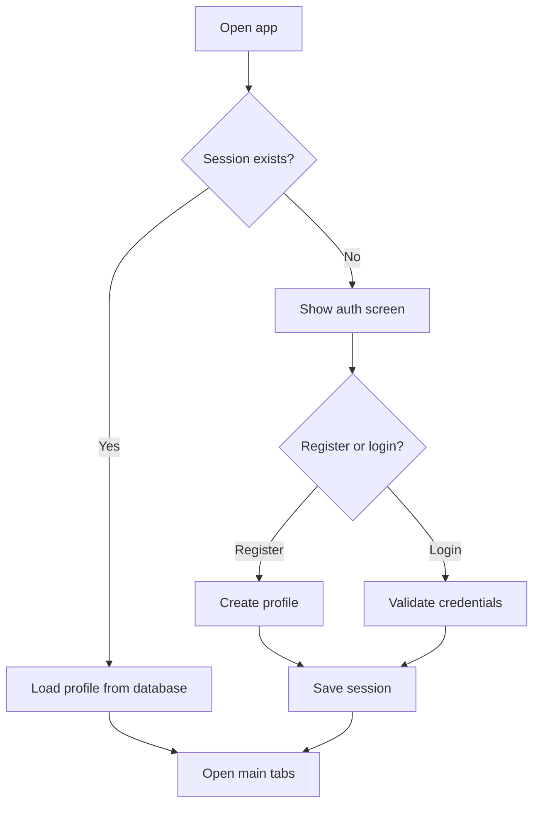
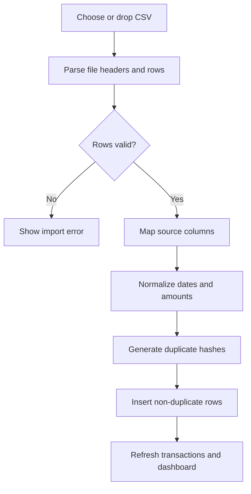
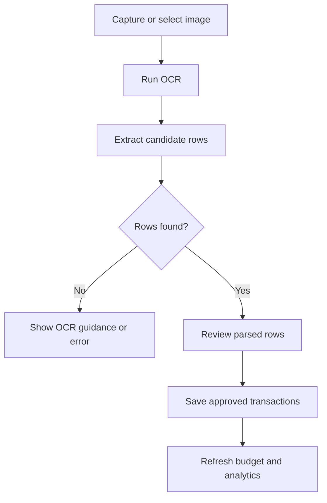
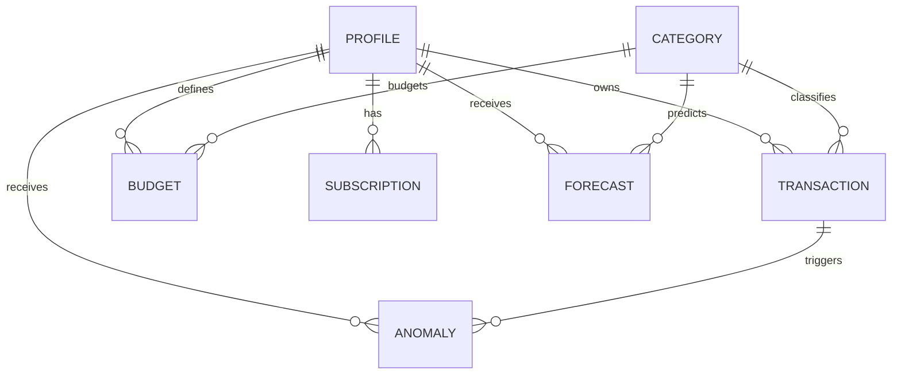

# FinSight Functional Requirements Supplement

This supplement provides the missing business-analysis deliverables that were not fully covered in the original requirements document.

## Use Cases

### UC-1 Register and Sign In

- Primary actor: User
- Preconditions: App is launched and no active session is loaded.
- Main flow:
  1. User opens the authentication screen.
  2. User enters registration or login data.
  3. System validates credentials.
  4. System stores or retrieves the profile.
  5. System saves the session and opens the main app.

### UC-2 Add a Manual Transaction

- Primary actor: User
- Preconditions: User is authenticated.
- Main flow:
  1. User opens the transactions screen.
  2. User enters date, merchant, amount, category, and optional note.
  3. System validates the form.
  4. System saves the transaction to SQLite.

### UC-3 Import Transactions from CSV

- Primary actor: User
- Preconditions: User is authenticated and has a CSV file.
- Main flow:
  1. User selects a CSV file or drops it into the Windows app.
  2. System parses headers and rows.
  3. User maps source columns to transaction fields.
  4. System normalizes amounts and dates.
  5. System imports non-duplicate transactions.

### UC-4 Create and Monitor a Budget

- Primary actor: User
- Preconditions: User is authenticated.
- Main flow:
  1. User opens the budgets screen.
  2. User creates or edits a monthly category budget.
  3. System stores the budget.
  4. System computes current progress from transaction totals.
  5. User reviews progress in the budget screen and dashboard.

### UC-5 Ask the AI Assistant a Finance Question

- Primary actor: User
- Preconditions: User is authenticated.
- Main flow:
  1. User opens the assistant screen.
  2. User asks a question about spending, budgets, or transactions.
  3. System builds assistant context from local data.
  4. System generates a local-model or fallback response.
  5. Assistant answer is displayed in chat.

## Activity Diagrams

### Authentication Flow

### CSV Import Flow

### OCR Capture Flow

## Domain Object Model and ER Diagram

### Core Entities

- `profiles`
- `categories`
- `transactions`
- `budgets`
- `subscriptions`
- `anomalies`
- `forecasts`
