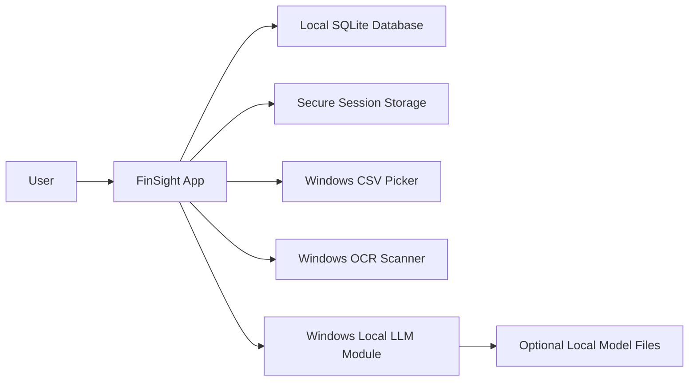
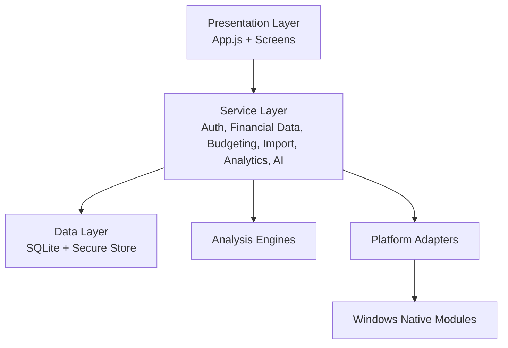
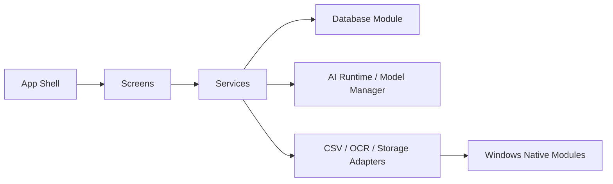
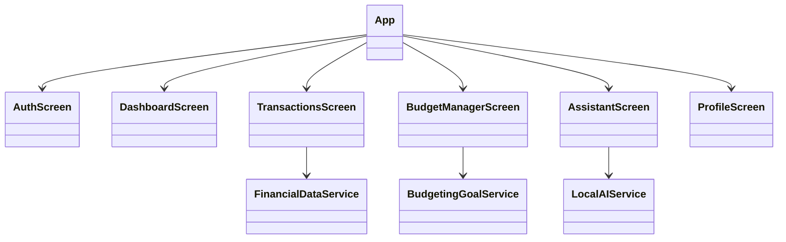
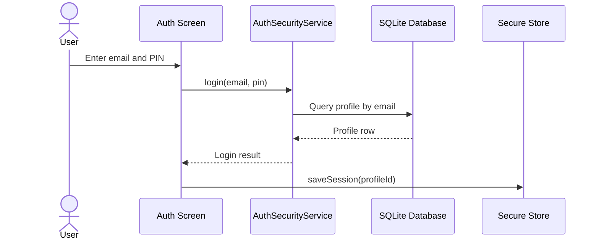
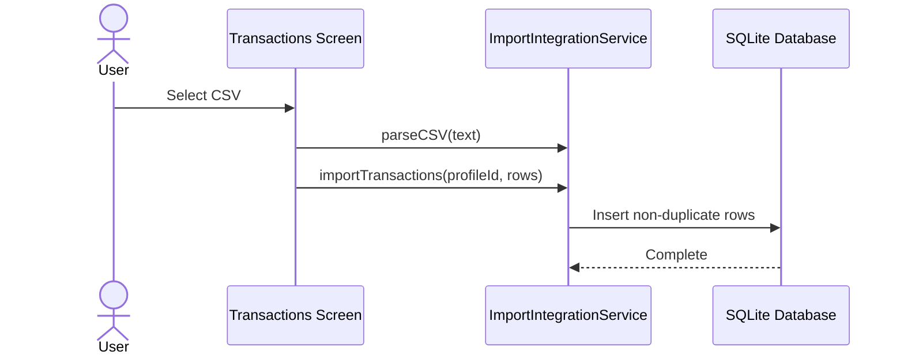
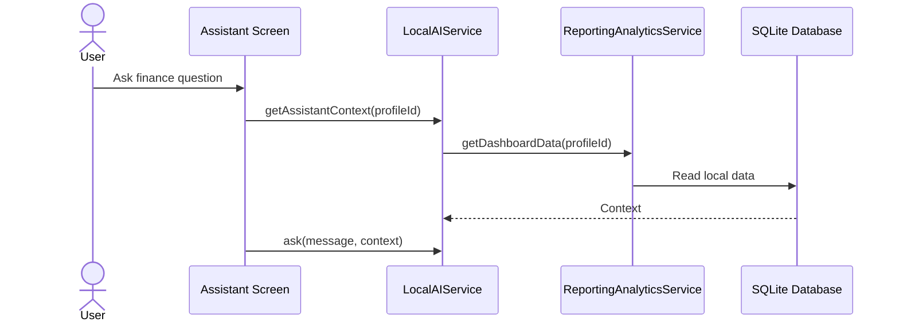

# FinSight Technical Design Specification

## Context (Deployment) Diagram

## Architecture Layout

## Component Diagram

- Existing image artifact: [Component Diagram.jpg](./Component%20Diagram.jpg)

## Class Hierarchy and Relationship Diagram

## Sequence Diagrams

### Login Sequence

### CSV Import Sequence

### Assistant Query Sequence

